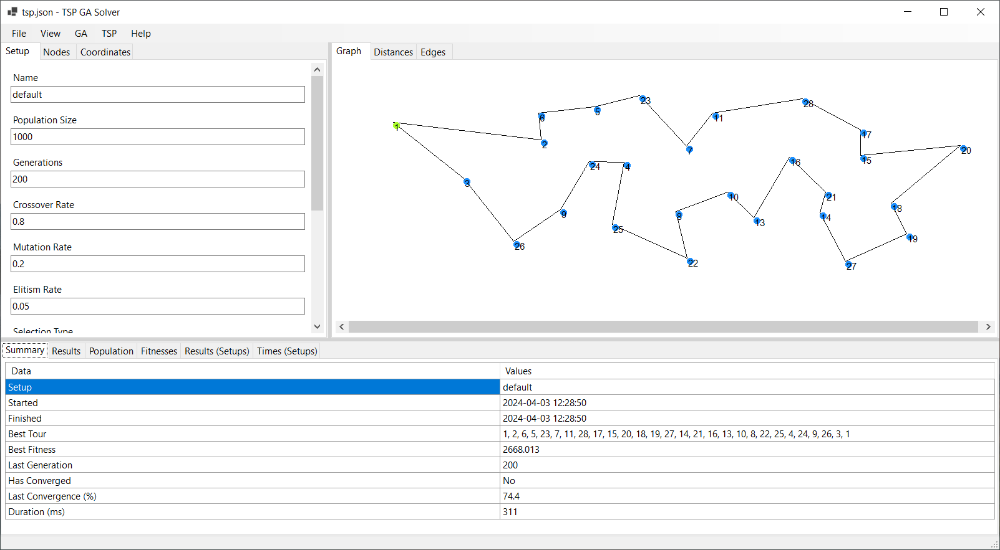

# TSP Solver using GA

TSP Solver application using a genetic algorithm to find the shortest path.

The genetic algorithm uses different operators for crossover and mutation,
and other parameters that can be set for the user.

The program was designed to compare results between different parameters
for a genetic algorithm, and to demonstrate an application to solve a problem
in a more effective an efficient way.

## How to use

1. Add nodes on the Graph canvas.
2. Adjust the following values for the algorithm:
   - Population size
   - Number of generations
   - Crossover rate and type
   - Mutation rate and type
   - Elitism rate and type
   - Selection type
3. Go to the GA menu and click on Solve.

The program will run the algorithm with the set parameters and return the best
tour, best fitness, and duration of the run.

## Requirements

- .NET Core 3.1
